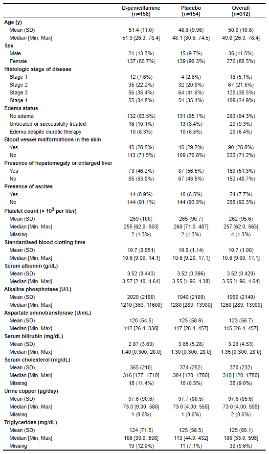

# table1

[](https://travis-ci.org/benjaminrich/table1)
[](https://CRAN.R-project.org/package=table1)
[](https://CRAN.R-project.org/package=table1)

An R package for generating tables of descriptive statistics in HTML.

## Installation

To install from CRAN:

``` r
install.packages("table1")
```

To install the latest development version directly from GitHub:

``` r
require(devtools)
devtools::install_github("benjaminrich/table1")
```

## Getting Started

An introduction to the package with examples is provided in the [vignette](https://benjaminrich.github.io/table1/vignettes/table1-examples.html).

## Example

For this example, we will use data from the Mayo Clinic trial in primary biliary cirrhosis (PBC) of the liver found in the `survival` package.

``` r
require(table1)
require(survival)

dat <- subset(survival::pbc, !is.na(trt))  # Exclude subjects not randomized

dat$trt     <- factor(dat$trt, levels=1:2, labels=c("D-penicillamine", "Placebo"))
dat$sex     <- factor(dat$sex, levels=c("m", "f"), labels=c("Male", "Female"))
dat$stage   <- factor(dat$stage, levels=1:4, labels=paste("Stage", 1:4))
dat$edema   <- factor(dat$edema, levels=c(0, 0.5, 1),
                      labels=c("No edema",
                               "Untreated or successfully treated",
                               "Edema despite diuretic therapy"))
dat$spiders <- as.logical(dat$spiders)
dat$hepato  <- as.logical(dat$hepato)
dat$ascites <- as.logical(dat$ascites)

label(dat$age)      <- "Age (y)"
label(dat$sex)      <- "Sex"
label(dat$stage)    <- "Histologic stage of disease"
label(dat$edema)    <- "Edema status"
label(dat$spiders)  <- "Blood vessel malformations in the skin"
label(dat$hepato)   <- "Presence of hepatomegaly or enlarged liver"
label(dat$ascites)  <- "Presence of ascites"
label(dat$platelet) <- "Platelet count (&times; 10<sup>9</sup> per liter)"
label(dat$protime)  <- "Standardised blood clotting time"
label(dat$albumin)  <- "Serum albumin (g/dL)"
label(dat$alk.phos) <- "Alkaline phosphotase (U/L)"
label(dat$ast)      <- "Aspartate aminotransferase (U/mL)"
label(dat$bili)     <- "Serum bilirubin (mg/dL)"
label(dat$chol)     <- "Serum cholesterol (mg/dL)"
label(dat$copper)   <- "Urine copper (&mu;g/day)"
label(dat$trig)     <- "Triglycerides (mg/dL)"

table1(~ age + sex + stage + edema + spiders + hepato + ascites +
         platelet + protime + albumin + alk.phos + ast + bili + chol +
         copper + trig | trt, data=dat)
```


